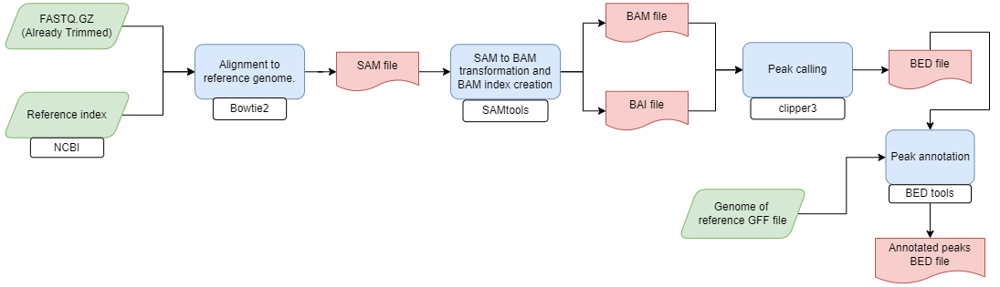

# nf-CLIP-Seq 

The CLIP-Seq analysis Pipeline

- A tool for CLIP-Seq data analysis from pre-processing to
peak-calling

---

### Workflow overview


---
## Requirements
#### Compatible OS*:
* [Ubuntu 18.04.03 LTS](http://releases.ubuntu.com/18.04/)

#### Software:
| Requirement | Version  | Required Commands * |
|:---------:|:--------:|:-------------------:|
| [Plan9 port](https://github.com/9fans/plan9port) | Latest (as of 10/01/2019 ) | mk \** |
| [Nextflow](https://www.nextflow.io/) | 21.04.2 | nextflow |
| [clipper](https://github.com/YeoLab/clipper) | - | clipper |
| [SAMtools](http://samtools.sourceforge.net/) | 1.4 | samtools |
| [BEDtools](https://bedtools.readthedocs.io/en/latest/) | 2.27.1 | annotate |

\* These commands must be accessible from your `$PATH` (*i.e.* you should be able to invoke them from your command line).  

\** Plan9 port builds many binaries, but you ONLY need the `mk` utility to be accessible from your command line.

### Installation
Download nf-CLIP-Seq  from Github repository:  
```
git clone https://github.com/fernanda-miron/nf-CLIP-Seq-Analysis.git
```
---

#### Test
To test nf-CLIP-Seq execution using test data, run:
```
bash runtest.sh
```
   Your console should print the Nextflow log for the run, once every process has been submitted, the following message will appear:

```
 ======
 Basic pipeline TEST SUCCESSFUL
 ======

```

nf-CLIP-Seq results for test data should be in the following file:
```
nf-CLIP-Seq-Analysis/test/data/results/nf-CLIP-Seq-results
```
---

### Usage
To run nf-CLIP-Seq go to the pipeline directory and execute:
```
nextflow run CLIP_seq.nf --fastq_file <path to input 1> [--output_dir path to results ]

```

For information about options and parameters, run:
```
nextflow run compare-miRNA-pairs.nf --help
```
---

#### Autors
Jose Eduardo Garcia-Lopez (jeduardogl655@gmail.com)
Diana Rogel (diana.rogel@mpi-bn.mpg.de)
Israel Aguilar-Ordonez (iaguilaror@gmail.com)
Fernanda Miron-Toruno (fernandamiront@gmail.com)

